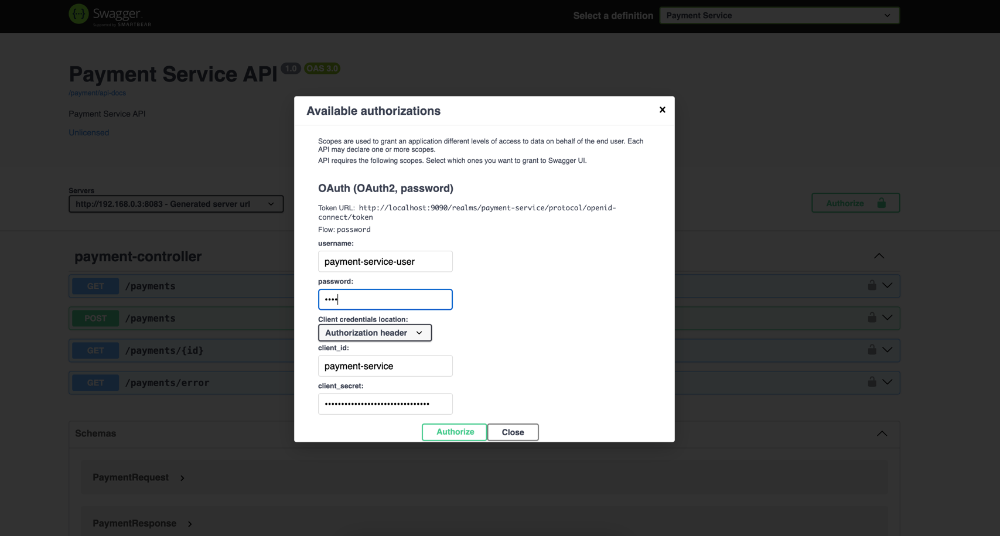

# 🚀 Syntra API Gateway Platform

> **A next-generation microservices ecosystem built with Spring Cloud Gateway, featuring advanced security, AI integration, and enterprise-grade scalability.**

[](https://openjdk.java.net/projects/jdk/21/)
[](https://spring.io/projects/spring-boot)
[](https://www.docker.com/)
[](LICENSE)

<!-- TABLE OF CONTENTS -->
<details open="open">
  <summary><h2 style="display: inline-block">📋 Table of Contents</h2></summary>
  <ol>
    <li><a href="#-overview">🌟 Overview</a></li>
    <li><a href="#-architecture">🏗️ Architecture</a></li>
    <li><a href="#-services">🔧 Services</a></li>
    <li><a href="#-key-features">✨ Key Features</a></li>
    <li><a href="#-getting-started">🚀 Getting Started</a></li>
    <li><a href="#-prerequisites">📋 Prerequisites</a></li>
    <li><a href="#-installation">⚡ Installation</a></li>
    <li><a href="#-api-documentation">📚 API Documentation</a></li>
    <li><a href="#-monitoring--observability">📊 Monitoring & Observability</a></li>
    <li><a href="#-references">📖 References</a></li>
  </ol>
</details>

---

## 🌟 Overview

**Syntra API Gateway Platform** is a comprehensive microservices architecture that demonstrates enterprise-level patterns and best practices. Built with Spring Cloud Gateway at its core, this platform showcases modern cloud-native development with integrated security, AI capabilities, and robust observability.

## 🏗️ Architecture

The Syntra platform follows a distributed microservices pattern with centralized gateway routing, service discovery, and configuration management.

## 🔧 Services

| Service | Port | Description | Key Technologies |
|---------|------|-------------|-----------------|
| **🌐 API Gateway** | 8080 | Central routing and load balancing | Spring Cloud Gateway, Rate Limiting |
| **👨‍🎓 Student Service** | 8081 | Student management with secure authentication | JPA, Keycloak, HCaptcha |
| **💳 Payment Service** | 8083 | Secure payment processing | Keycloak OAuth2, Database Integration |
| **🤖 OpenAI Service** | 8084 | AI-powered intelligent responses | OpenAI API, GPT Integration |
| **📋 Service Registry** | 8761 | Service discovery and registration | Eureka Server |
| **⚙️ Config Server** | 8888 | Centralized configuration management | Spring Cloud Config |
| **📖 Swagger Application** | 8082 | Unified API documentation | SpringDoc OpenAPI 3 |

## ✨ Key Features

### 🔒 Security & Authentication
- **🛡️ Keycloak Integration**: Enterprise-grade OAuth2/OpenID Connect authentication
- **🔐 JWT Token Management**: Secure token-based authentication across services
- **🤖 reCAPTCHA/HCaptcha**: Bot protection for sensitive endpoints
- **🚦 Rate Limiting**: Redis-based request throttling and DoS protection

### 🚀 Cloud-Native Architecture
- **🌐 API Gateway**: Intelligent routing with Spring Cloud Gateway
- **🔍 Service Discovery**: Eureka-based automatic service registration
- **⚙️ Config Management**: Centralized configuration with Spring Cloud Config
- **📦 Containerization**: Docker and Docker Compose ready
- **☸️ Kubernetes**: Production deployment configurations included

### 🔄 Event-Driven & Messaging
- **🐰 RabbitMQ**: Asynchronous message processing
- **📊 Event Sourcing**: Reliable inter-service communication
- **🔄 Reactive Programming**: Non-blocking I/O with WebFlux

### 🤖 AI & Intelligence
- **🧠 OpenAI Integration**: GPT-powered intelligent responses
- **💬 Conversational APIs**: Natural language processing capabilities
- **📊 AI Analytics**: Smart data insights and recommendations

### 📊 Observability & Monitoring
- **📈 Micrometer Tracing**: Distributed tracing with Zipkin
- **📝 Structured Logging**: JSON-formatted logs with MDC context
- **🎯 Health Checks**: Comprehensive actuator endpoints
- **📊 Metrics Collection**: Prometheus-compatible metrics

### 🛠️ Developer Experience
- **📚 OpenAPI 3.0**: Interactive API documentation with Swagger UI
- **🧪 Testing Suite**: Comprehensive Postman collections
- **🔄 Hot Reload**: Development-time auto-restart
- **🐳 Local Development**: One-command Docker setup

---

## 🚀 Getting Started

Get your Syntra API Gateway Platform up and running in minutes with our streamlined setup process.

---

## 📋 Prerequisites

### 🔧 Required Tools

| Tool | Version | Purpose | Installation Guide |
|------|---------|---------|-------------------|
| **☕ Java** | 21+ | Runtime Environment | [Install Java](https://java.com/en/download/help/download_options.html) |
| **🛠️ Maven** | 3.6+ | Build Tool | [Install Maven](https://maven.apache.org/install.html) |
| **🐳 Docker** | 20+ | Containerization | [Install Docker](https://docs.docker.com/get-docker) |

```bash
# Verify installations
java --version    # Should show Java 21+
mvn --version     # Should show Maven 3.6+
docker --version  # Should show Docker 20+

# Set JAVA_HOME (macOS/Linux)
export JAVA_HOME=$(/usr/libexec/java_home -v 21)

# Set JAVA_HOME (Windows)
set JAVA_HOME=C:\Program Files\Java\jdk-21
```

### 🔑 API Keys & Configuration

#### 🤖 OpenAI API Key (Required for AI features)
1. Visit [OpenAI API Keys](https://platform.openai.com/account/api-keys)
2. Create a new secret key
3. Copy the value and add it to `.env` as `YOUR_API_KEY_HERE`

#### 🔒 reCAPTCHA Setup (Optional)
1. Go to [Google reCAPTCHA Admin](https://www.google.com/recaptcha/admin/create)
2. Create a new site and get your keys
3. Add `SITE_KEY` and `SECRET_KEY` to `.env`

#### 🤖 HCaptcha Integration (Optional)
- Multiple implementation examples available in `student-service`
- Check [HCaptchaController.java](student-service/src/main/java/com/syntra/studentservice/api/controller/HCaptchaController.java)

### 🛠️ Optional Tools

- **[Postman](https://www.postman.com/downloads/)**: API testing with pre-built collections
- **[IntelliJ IDEA](https://www.jetbrains.com/idea/)**: Recommended IDE
- **[VS Code](https://code.visualstudio.com/)**: Alternative lightweight editor

---

## ⚡ Installation

### 🚀 Quick Start

```bash
# 1. Clone the repository
git clone https://github.com/YOUR-USERNAME/api-gateway-syntra.git
cd api-gateway-syntra

# 2. Configure environment variables
cp .env.example .env
# Edit .env with your API keys
```

### 🔥 Launch Options

#### 🎆 Option 1: Docker Compose (Recommended)
```bash
# Start all services with one command
docker-compose --profile start_application up -d --build

# Check service status
docker-compose ps

# View logs
docker-compose logs -f
```

#### 🔨 Option 2: Manual Setup
```bash
# 1. Start infrastructure services
docker-compose up -d postgres rabbitmq keycloak

# 2. Build all services
for service in api-gateway student-service payment-service openai-service service-registry swagger-application; do
  cd $service
  mvn clean install
  cd ..
done

# 3. Start services in order
cd service-registry && mvn spring-boot:run &
cd api-gateway && mvn spring-boot:run &
cd student-service && mvn spring-boot:run &
cd payment-service && mvn spring-boot:run &
cd openai-service && mvn spring-boot:run &
cd swagger-application && mvn spring-boot:run &
```

#### 🚀 Option 3: IDE Integration
1. Import project into your IDE
2. Enable [spring.docker.compose](api-gateway/src/main/resources/application.yml) property
3. Run [ApiGatewayApplication.java](api-gateway/src/main/java/com/syntra/apigateway/ApiGatewayApplication.java)
4. Infrastructure services will auto-start via Docker Compose

### 🔐 Keycloak Configuration

```bash
# 1. Access Keycloak Admin Console
open http://localhost:9090/admin
# Login: admin / admin
```

**Setup Steps:**

1. **🏰 Import Realm**
   - Click `Create realm` → Import
   - Select [payment-service-realm-export.json](docs/keycloak/payment-service-realm-export.json)

2. **🔑 Configure Client Secret**
   - Go to `Clients` → `payment-service` → `Credentials`
   - Click `Regenerate` and copy the secret
   - Add to `.env` as `PAYMENT_CLIENT_SECRET_ENV`

3. **👤 Create Test User**
   ```
   Username: payment-service-user
   Password: test (disable "Temporary")
   Role: admin
   ```

4. **🔄 Restart Services**
   ```bash
   docker-compose restart student-service
   ```

## 📚 API Documentation

### 🔍 Service Endpoints

| Service | URL | Description |
|---------|-----|-------------|
| **🌐 API Gateway** | http://localhost:8080 | Main application entry point |
| **📖 Swagger UI** | http://localhost:8080/swagger-ui.html | Interactive API documentation |
| **📊 Actuator** | http://localhost:8080/actuator | Health checks and metrics |
| **🔍 Service Discovery** | http://localhost:8761 | Eureka dashboard |
| **🔐 Keycloak Admin** | http://localhost:9090/admin | Authentication management |

### 🔒 API Authentication

**For Swagger UI testing:**

1. Open [Swagger UI](http://localhost:8080/swagger-ui.html)
2. Select `Payment Service` from dropdown
3. Click **🔐 Authorize** button
4. Enter credentials:
   ```
   Username: payment-service-user
   Password: test
   Client ID: payment-service
   Client Secret: [from .env PAYMENT_CLIENT_SECRET_ENV]
   ```
5. Click **Authorize** → **Close**
6. 🎉 Start testing protected endpoints!



## 📊 Monitoring & Observability

### 📈 Health Checks
```bash
# Check all services health
curl http://localhost:8080/actuator/health

# Individual service health
curl http://localhost:8081/actuator/health  # Student Service
curl http://localhost:8083/actuator/health  # Payment Service
```

### 📝 Logging
- **Structured JSON logs** with correlation IDs
- **Distributed tracing** with Zipkin integration
- **MDC context** for cross-service correlation

### 📊 Metrics
- Prometheus-compatible metrics at `/actuator/metrics`
- Custom business metrics included
- Performance monitoring enabled

---

## ☸️ Production Deployment

### 🚀 Kubernetes
See [Kubernetes Deployment Guide](KubernetesDeploymentGuide.md) for production setup.

### 🐳 Docker Production
```bash
# Build production images
docker-compose -f docker-compose.prod.yml build

# Deploy with production profiles
docker-compose -f docker-compose.prod.yml up -d
```

---

## 📖 References

### 📚 Documentation
- **[Technical References](References.md)** - Detailed technical documentation
- **[Kubernetes Guide](KubernetesDeploymentGuide.md)** - Production deployment
- **[Postman Collections](docs/postman_collection)** - API testing templates

### 🔗 Useful Links
- **[Spring Cloud Gateway](https://spring.io/projects/spring-cloud-gateway)** - API Gateway framework
- **[Keycloak](https://www.keycloak.org/)** - Identity and access management
- **[OpenAPI 3.0](https://swagger.io/specification/)** - API specification standard
- **[Docker Compose](https://docs.docker.com/compose/)** - Multi-container orchestration

### 🎆 Community
- **Issues**: Report bugs and request features
- **Discussions**: Community Q&A and ideas
- **Contributing**: Guidelines for contributors

---

## 📜 License

This project is licensed under the MIT License - see the [LICENSE](LICENSE) file for details.

---

## 🚀 Built with ❤️ by Syntra Team

**Made with modern technologies for the cloud-native era.**

🌟 **Star this repo** if you find it helpful!

---
